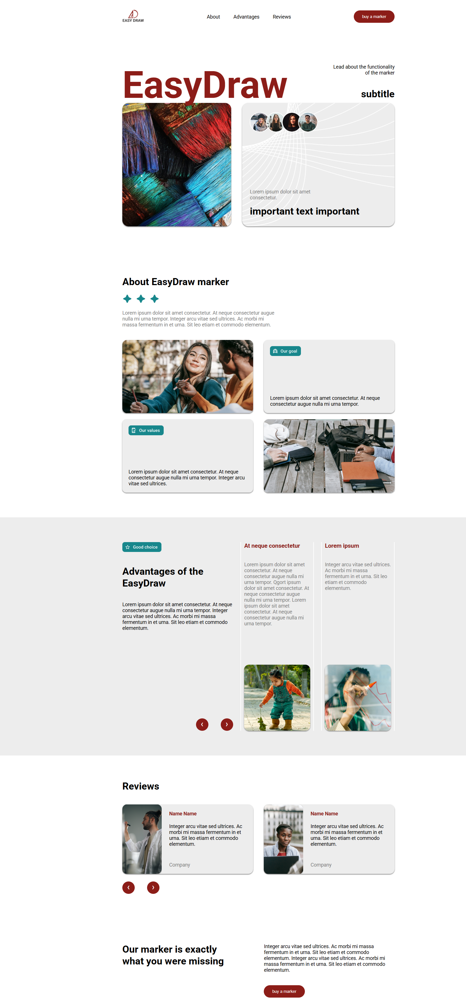

# Simple landing

## О проекте
Адаптивный лендинг, сверстанный по макету из Figma.

## Ссылка на демо
👉 https://github.com/SergeyGro/simple-landing.git

## Скриншот

## Технологии
- HTML5
- CSS3 (Flexbox)
- JavaScript (бургер-меню)
- Figma

## Что сделано
- Адаптивная верстка (мобилки, планшеты, десктоп)
- Семантическая верстка
- Бургер-меню на мобилках
- Плавные ховеры и анимации

## Как открыть
1. Скачай архив
2. Распакуй
3. Открой `index.html` в браузере

## Макет в Figma
https://www.figma.com/community/file/1359648849743877901/free-landing-page-example-adaptation-easy-to-learn-material-design-3

## Контакты
- Telegram: @Crassys https://t.me/Crassys
- GitHub: SergeyGro https://github.com/SergeyGro